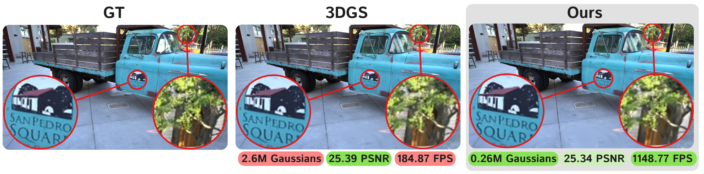

# Speedy-Splat: Fast 3D Gaussian Splatting with Sparse Pixels and Sparse Primitives

[Alex Hanson](https://www.cs.umd.edu/~hanson/), [Allen Tu](https://tuallen.github.io), [Geng Lin](https://www.cs.umd.edu/people/geng), [Vasu Singla](https://vasusingla.github.io/), [Matthias Zwicker](https://www.cs.umd.edu/~zwicker/), [Tom Goldstein](https://www.cs.umd.edu/~tomg/)

[arXiv]() | [Website](https://speedysplat.github.io)



This is the official code repository for the paper "Speedy-Splat: Fast 3D Gaussian Splatting with Sparse Pixels and Sparse Primitives". It is built from the [3D-GS](https://github.com/graphdeco-inria/gaussian-splatting) repository. If you make use of this code in your research, please consider citing this work in addition to ours.


**Abstract:** *3D Gaussian Splatting (3D-GS) is a recent 3D scene reconstruction technique that enables real-time rendering of novel views by modeling scenes as parametric point clouds of differentiable 3D Gaussians.  However, its rendering speed and model size still present bottlenecks, especially in resource-constrained settings.  In this paper, we identify and address two key inefficiencies in 3D-GS, achieving substantial improvements in rendering speed, model size, and training time.  First, we optimize the rendering pipeline to precisely localize Gaussians in the scene, boosting rendering speed without altering visual fidelity.  Second, we introduce a novel pruning technique and integrate it into the training pipeline, significantly reducing model size and training time while further raising rendering speed.  Our \acronym{} approach combines these techniques to accelerate average rendering speed by a drastic 6.71x across scenes from the Mip-NeRF 360, Tanks \& Temples, and Deep Blending datasets  with 10.6x fewer primitives than 3D-GS.*

## Setup
Follow the setup instructions for the original [3D-GS](https://github.com/graphdeco-inria/gaussian-splatting) codebase. Our code changes are made in (1) the differential renderer submodule and (2) the Python files in this repo.

## Running

To train and evaluate a scene with Speedy-Splat, set the environment variables `SCENE_DATA_PATH` and `SCENE_MODEL_PATH`, then run:

```shell
bash train.sh
```

* `SCENE_DATA_PATH` is the path to the COLMAP or NeRF Synthetic dataset.

* `SCENE_MODEL_PATH` is the path where the model will be saved.

This script follows the 3D-GS pipeline to train a scene on the data provided by `SCENE_DATA_PATH` and saves the model in the `SCENE_MODEL_PATH` directory. Tensorboard logging has been updated to include all metrics reported in the Speedy-Splat manuscript.

### Scene Metrics

To compute scene metrics for an already trained model, set the environment variables `SCENE_DATA_PATH`,`SCENE_MODEL_PATH`, and `ONLY_RAW_KERNEL_TIMES` then run:

```shell
bash compute_scene_metrics.sh
```

* `SCENE_DATA_PATH` is the path to the COLMAP or NeRF Synthetic dataset.

* `SCENE_MODEL_PATH` is the path to the pretrained 3D-GS model.

* `ONLY_RAW_KERNEL_TIMES` is a boolean (`true`|`false`) variable. When true, the kernel only returns raw kernel time per image.

This script returns all metrics reported in Speedy-Splat for a pretrained model located in `SCENE_MODEL_PATH` with corresponding data in `SCENE_DATA_PATH`. The metrics will be written to a CSV file located in `SCENE_MODEL_PATH/<train|test>/ours_<iteration>/metrics.csv`, where `train`|`test` is the corresponding dataset split and `iteration` is the model checkpoint iteration.

If `ONLY_RAW_KERNEL_TIMES` is set to `true`. then the script will generate a `kernel_times.csv` file instead in the same directory as `metrics.csv`. Each row in the CSV records the raw kernel time to render the corresponding image in milliseconds. Currently, this script sequentially renders and records each image in the dataset, then repeats this process 20 times.

## Results


<section class="section" id="BibTeX">
  <div class="container is-max-desktop content">
    <h2 class="title">BibTeX</h2>
    <pre><code>@Article{HansonSpeedy,
      author       = {Hanson, Alex and Tu, Allen and Lin, Geng, and Singla, Vasu and Zwicker, Matthias and Goldstein, Tom},
      title        = {Speedy-Splat: Fast 3D Gaussian Splatting with Sparse Pixels and Sparse Primitives},
      journal      = {arXiv},
      year         = {2024}
}</code></pre>
  </div>
</section>


## Funding and Acknowledgments

This work was made possible by the IARPA WRIVA Program, the ONR MURI program, and DAPRA TIAMAT. Commercial support was provided by Capital One Bank, the Amazon Research Award program, and Open Philanthropy. Further support was provided by the National Science Foundation (IIS-2212182), and by the NSF TRAILS Institute (2229885). Zwicker was additionally supported by the National Science Foundation (IIS-2126407).
